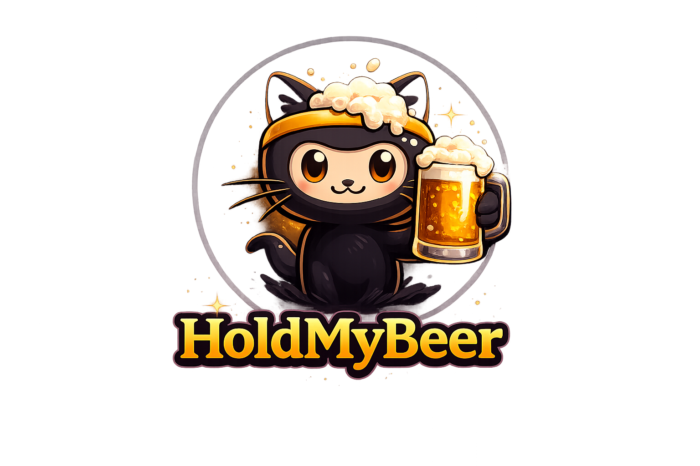

<p align="center">
  
</p>

# 🍺 HoldMyBeer (v0.3)

> **Change one requirement. Only the affected code regenerates. Your handwritten code stays untouched.**

HoldMyBeer is an AI-powered software compiler and change management engine. When a requirement evolves or gets deleted, the engine maps the changes to your system and regenerates only what is necessary, preserving all custom developer code edits.

It accomplishes this by treating your software project as a semantic dependency graph of requirements, features, API endpoints, entity schemas, tasks, code files, and tests: the **Project Semantic Model (PSM)** stored at `.holdmybeer/psm.json`. Markdown files are only generated as human-readable exports. 

### Why HoldMyBeer?
- **Incremental Code Regeneration**: When a requirement changes mid-project, the internal **Impact Engine** calculates the blast radius, marks downstream files stale, and regenerates only what is necessary.
- **Developer Safety Shields**: Prevent AI from overwriting manual code edits by assigning `ownership` set as `"manual"` or `"mixed"` to file nodes. The impact engine and builder will preserve these files and flag them for human review.
- **Traceability Guarantee**: Strict graph compilation verifies that every single requirement traces down to an API endpoint/Entity schema, an implementation task, a specific source file, and an acceptance test suite.

---

## Supported Platforms

| Platform | Status | Mechanism |
|---|---|---|
| Claude Code | ✅ | `SKILL.md` skills + slash commands |
| Gemini CLI | ✅ | `.toml` custom commands |
| Codex CLI | ✅ | `SKILL.md` skills (same open standard as Claude) |
| Cursor | ✅ | `.mdc` rules (description-matched adapters) |

Claude Code is the primary, most complete target — the other adapters port the same logic into each tool's own convention. See each platform's own README (`gemini/README.md`, `codex/README.md`) for details.

---

## Install

```bash
git clone https://github.com/yourname/hold-my-beer
cd hold-my-beer
```

**Windows:**
```powershell
.\install.ps1                  # installs for Claude Code (default)
.\install.ps1 -Platform all    # installs for every auto-installable platform
```

**macOS/Linux:**
```bash
./install.sh                   # installs for Claude Code (default)
./install.sh --platform all    # installs for every auto-installable platform
```

The installer detects your local AI configurations (`~/.claude`, `~/.gemini`, `~/.codex`), copies the skills, and **never overwrites existing files** unless you pass `-Force` / `--force`.

For **Cursor**, copy the rules manually:
```bash
cp cursor/rules/*.mdc your-project/.cursor/rules/
```

To uninstall:
```powershell
.\uninstall.ps1
```
```bash
./uninstall.sh
```

---

## Workflow

```
Requirements / Changes
  ↓
/hmb          (Verify/Scaffold PSM tab)
  ↓
/hmb-crack    (Extract requirements to PSM.domain & export spec.md)
  ↓
/hmb-sniff    (Validate requirements coverage & check confidence)
  ↓
/hmb-brew     (Phase architecture APIs/Entities/Tasks & export blueprint.md)
  ↓
/hmb-ferment  (Validate planning coverage against features)
  ↓
/hmb-pour     (Implement code & tests task-by-task. Obeys protected gates)
  ↓
/hmb-hangover (Pre-merge trace audit of full codebase and PSM compliance)
  ↓
[Requirement Drift / Change Injection]
  ↓
/hmb-impact   (Calculates blast radius, marks downstream stale/regen tasks)
  ↓
/hmb-pour     (Regenerates stale target tasks only)
```

See [`docs/workflow.md`](docs/workflow.md) for details.

---

## Technical Specifications & Schema

HoldMyBeer is governed by a strict internal definition:
- [`shared/MODEL_SCHEMA.md`](shared/MODEL_SCHEMA.md) — Node definitions (Requirement, Feature, Entity, API, Task, Artifact, Test), relationships, patches delta-logs, confidence scores, and ownership shields.
- [`shared/MODEL_VALIDATION.md`](shared/MODEL_VALIDATION.md) — The 9 core model validation rules (`V.1` to `V.9`).
- [`shared/MODEL_QUERIES.md`](shared/MODEL_QUERIES.md) — The 5 named fragment queries (`Q.DOMAIN`, `Q.ARCHITECTURE`, `Q.TASK_GRAPH`, `Q.COVERAGE`, `Q.IMPACT`).
- [`shared/DSL.md`](shared/DSL.md) — High-density symbolic pipeline operators and flag configurations.
- [`shared/CONSTITUTION.md`](shared/CONSTITUTION.md) — Engineering standards.

---

## Available Commands

HoldMyBeer runs a 7-stage build/verify pipeline plus an Impact Engine:

| Command | Action | Output Flavor |
|---|---|---|
| `/hmb` | Scaffolds workspace Project Model | `🍺 Opening a tab...` |
| `/hmb-crack` | Extracts domain requirements | `🍺 Cracking open a fresh specification...` |
| `/hmb-sniff` | Validates requirements specification and quality | `👃 Sniffing for bad hops...` |
| `/hmb-brew` | Generates architectural planning | `🍻 Brewing the perfect architecture...` |
| `/hmb-ferment` | Validates design coverage and task plans | `🧪 Fermenting under pressure...` |
| `/hmb-pour` | Executes code implementation | `🍺 Hold my beer... writing production code.` |
| `/hmb-hangover` | Runs final pre-merge compliance audit | `🤕 Checking tomorrow morning's hangover...` |
| `/hmb-impact` | Analyzes change blast radius | `⚡ Calculating blast radius...` |

---

## Best Practices & Limitations

- **Model-First Change Flow**: Edit requirements or architecture through `/hmb-crack` / `/hmb-brew` rather than editing generated code blocks directly, keeping the Project Model as the single source of truth.
- **Model Drift (No Reverse-Sync)**: Custom edits made by developers directly inside the codebase are **not** back-imported or reverse-synchronized into the Project Model.
- **Set Ownership Shields Early**: If you implement a class/method manually, set `"ownership": "manual"` or `"ownership": "mixed"` on that `Artifact` node in `.holdmybeer/psm.json` to prevent downstream regeneration.
- **Address blockers immediately**: A verdict of `[BLOCKED]` or `[FAIL]` from validation and review gates halts progress. Resolve before proceeding.
- **Keep it generic**: HoldMyBeer is language-agnostic. Customize compile behavior via the project's local `.holdmybeer/constitution.md`. See [`docs/customization.md`](docs/customization.md).

---

## Repository Layout

```
hold-my-beer/
├── shared/      Shared prompt foundations (CONSTITUTION.md, DSL.md, PSM_SCHEMA.md...)
├── bin/         Init CLI binaries
├── claude/      Claude Code SKILL.md skills and command markdown adapters
├── gemini/      Gemini CLI TOML configuration commands and human-readable prompts
├── codex/       Codex CLI adapter rules (Claude SKILL.md mirror)
├── cursor/      Cursor MDC rules
├── docs/        Workflow, philosophy, and customization guides
├── assets/      Static resource visual files
├── install.ps1 / install.sh      Installers
└── uninstall.ps1 / uninstall.sh  Uninstallers
```

## License

MIT — see [`LICENSE`](LICENSE).
